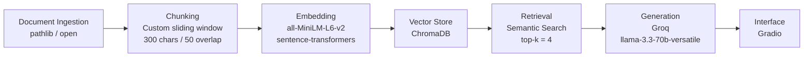

# Project 1 Planning: The Unofficial Guide

> Write this document before you write any pipeline code.
> Your spec and architecture diagram are what you'll use to direct AI tools (Claude, Copilot, etc.) to generate your implementation — the more specific they are, the more useful the generated code will be.
> Update the Retrieval Approach and Chunking Strategy sections if you change your approach during implementation.
> Update this file before starting any stretch features.

---

## Domain

The Unofficial St. Philip's College Survival Guide — real student knowledge about surviving and thriving at SPC that never appears in official handbooks or orientation packets. This includes honest professor reviews, financial aid tips, registration frustrations, campus safety concerns, and advice about programs like Alamo Promise. This knowledge is valuable because official sources give the marketing version; students need the real version.

---

## Documents

<!-- List your specific sources: URLs, subreddit names, forum threads, or file descriptions.
     Aim for at least 10 sources that together cover different subtopics or perspectives within your domain. -->

| # | Source | Description | URL or location |
|---|--------|-------------|-----------------|
| 1 | | | |
| 2 | | | |
| 3 | | | |
| 4 | | | |
| 5 | | | |
| 6 | | | |
| 7 | | | |
| 8 | | | |
| 9 | | | |
| 10 | | | |

---

## Chunking Strategy

**Chunk size:** 300 characters

**Overlap:** 50 characters

**Reasoning:** Most of our documents are short student reviews — 2 to 5 sentences expressing a single opinion or experience. A 300-character chunk is large enough to capture a complete thought (one full review or one key piece of advice) without merging unrelated opinions together. Overlap of 50 characters ensures that if a review spans a chunk boundary, the key advice isn't lost. Smaller chunks (like 100 characters) would fragment individual reviews into meaningless pieces; larger chunks (like 600 characters) would merge multiple unrelated student opinions into one chunk, making retrieval too broad to be useful.

---

## Retrieval Approach

**Embedding model:** all-MiniLM-L6-v2 via sentence-transformers (runs locally, no API key needed)

**Top-k:** 4

**Production tradeoff reflection:** For a real deployment, I would consider OpenAI's text-embedding-3-small for higher accuracy on domain-specific text, but it costs money per API call and requires an internet connection. all-MiniLM-L6-v2 runs locally with no rate limits, which is ideal for a student project. If the guide needed to serve Spanish-speaking SPC students, I would switch to a multilingual model like paraphrase-multilingual-MiniLM-L12-v2. Top-k of 4 gives the LLM enough context to answer most questions without flooding it with loosely related chunks.

---

## Evaluation Plan

| # | Question | Expected answer |
|---|----------|-----------------|
| 1 | What do students say about the registration process at St. Philip's College? | Students report the registration process is frustrating and the student portal is difficult to navigate. Multiple reviewers mention it is hard to reach a human for help. |
| 2 | What is the Alamo Promise and who is eligible? | Alamo Promise covers tuition and mandatory fees for eligible students from Bexar County high schools who enroll in the fall immediately after graduation and complete FAFSA or TASFA. Transfer students are not eligible. |
| 3 | What do students say about Professor McCall's class? | Students say Professor McCall's class is easy if you watch the videos and do the work on time. Assignments have videos to follow, there is extra credit, and the professor responds to emails quickly. |
| 4 | Is St. Philip's College safe at night? | Some students report feeling unsafe at night due to homeless individuals near campus. Night classes are mentioned as a concern by multiple reviewers. |
| 5 | What student services are available at St. Philip's College? | SPC offers advising, financial aid, tutoring, career services, and disability support services among others. Students note that advisor availability can be inconsistent. |

---

## Anticipated Challenges

1. **Review text is noisy and inconsistent** — Student reviews vary wildly in length, grammar, and specificity. Some reviews are one sentence ("great school!") while others are several paragraphs. Very short reviews may not embed meaningfully enough to match specific queries, producing weak retrieval results.

2. **Source attribution may be ambiguous** — Multiple documents cover overlapping topics (e.g., both Niche and Google reviews mention advisors and registration). The system may retrieve chunks from the wrong source or mix sources in a single answer, making it hard for users to verify where the information came from.

3. **Official documents vs. student opinions may conflict** — The Alamo Promise and Student Services documents describe things as they're supposed to work; student reviews describe reality. The system may retrieve both and produce a confusing or contradictory answer.

---

## Architecture

---

## AI Tool Plan

**Milestone 3 — Ingestion and chunking:**
I'll give Claude my Chunking Strategy section and Documents table and ask it to implement a load_documents() function that reads all .txt files from the /docs folder and a chunk_text() function that splits text into 300-character chunks with 50-character overlap. I'll verify the output by printing 5 sample chunks and checking they are readable and self-contained.

**Milestone 4 — Embedding and retrieval:**
I'll give Claude my Retrieval Approach section and pipeline diagram and ask it to implement an embed_and_store() function using all-MiniLM-L6-v2 and ChromaDB, and a retrieve() function that returns the top 4 chunks with source metadata. I'll verify by running 3 test queries and checking that returned chunks are relevant and distance scores are below 0.5.

**Milestone 5 — Generation and interface:**
I'll give Claude my grounding requirement (answer only from retrieved context, cite sources) and ask it to implement a generate_response() function using Groq's llama-3.3-70b-versatile and a Gradio interface. I'll verify by checking that responses cite sources and that out-of-scope questions are refused rather than answered from general knowledge.
